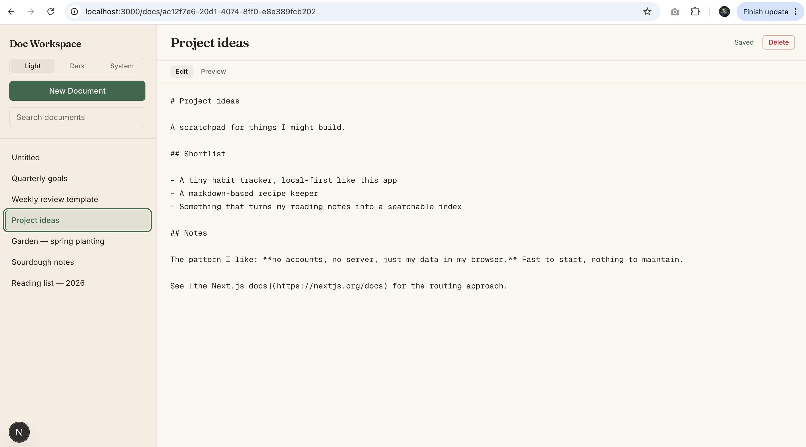
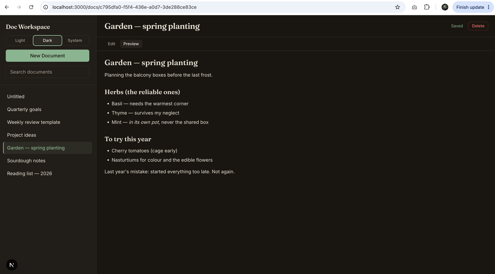

# Doc Workspace

A personal, local-first document management app: write, organize, and search your documents in Markdown, all stored right in your browser. There are no accounts, no backend, and no server — open it and start writing. Built with Next.js (App Router), TypeScript, and Tailwind CSS.

## Features

- **Create, edit, and delete** documents, each with a title and a Markdown body.
- **Auto-save** — changes are saved automatically as you type (debounced), with a subtle "Saved" indicator.
- **Per-document URLs** — every document has its own address (e.g. `/docs/abc123`), so you can bookmark or share a direct link to it.
- **Search** — filter the document list by title as you type.
- **Markdown editing** with an **Edit / Preview** toggle to switch between the raw Markdown and the rendered result.
- **"Document not found"** page for bad or stale URLs, with a link back to the workspace.
- **Keyboard support** — pressing Enter in the title jumps focus straight to the body.
- **Manual light / dark / system theme toggle**, remembered across reloads.
- **Responsive layout** — a two-pane workspace on desktop, with a collapsible drawer on mobile.

## Screenshots

**Light mode** — editing a document's Markdown:



**Dark mode** — the rendered Markdown preview:



## Running it locally

Requires **Node.js 20 or newer**.

```bash
npm install
npm run dev
```

Then open **http://localhost:3000** and click **Open Workspace** (or go straight to `/docs`).

## Tech stack

- **Next.js** (App Router) + **React**
- **TypeScript**
- **Tailwind CSS**
- **IndexedDB** for local persistence (no wrapper library) — documents live in your browser and survive reloads
- **react-markdown** for safe Markdown rendering

## Optional task: manual light / dark / system theme toggle

The optional feature I chose to build is the **theme toggle** in the sidebar — a three-way Light / Dark / System control:

- **System** follows your OS appearance and updates live if you change it.
- **Light** / **Dark** override it explicitly.
- Your choice is **persisted** across reloads, and there is **no flash of the wrong theme** on load — a small render-blocking script sets the theme before the page paints.

## Notes

- All data is stored locally in the browser (IndexedDB) and never leaves your machine — clearing site data will remove your documents.
- Design and engineering decisions, and a few things that went sideways, are written up in [`REFLECTION.md`](REFLECTION.md).
